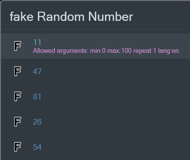
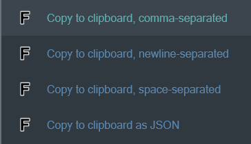

# Fake Data — a Flow Launcher plugin

This plugin generates fake data for testing purposes. It can generate fake names, addresses, emails, phone numbers,
and more. It uses the [Bogus](https://github.com/bchavez/Bogus/) library to generate data.

## Usage

To use the plugin, type `fake` followed by the category and the type of data you want to generate. For example, to
generate a fake name, type `fake name full`.

Some commands can accept parameters. For example, to generate a random number between 100 and 200,
type `fake random number min:100 max:200`. When you select a category and a command, all arguments the command accepts
are shown below the first result:

Two arguments are available for all commands: `repeat` and `lang`. The `repeat` argument specifies how many times the
command should be repeated. The `lang` argument specifies the language of the generated data. The default language is
English. To generate a fake name in Spanish, type `fake name full lang:es`. Note that not all commands support all
languages. The `lang` argument is ignored if the command does not support the specified language.

`fake address city` without arguments:

`fake address city lang:de`:

`fake address city lang:de repeat:5`:

If you're using the `repeat` argument, the context menu for results will contain an option to copy the result in
different formats:

